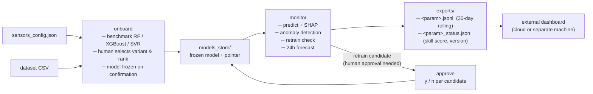

# Predictive Water Quality Monitoring and Operational Decision Support Using AI and IoT

Internship project — SESC, Nile University, Giza. IEEE NILES 2026 paper in preparation.

---

## What this system does

A config-driven pipeline that trains one independent predictive model per water quality
parameter (pH, EC, Turbidity), explains every prediction with SHAP feature importance,
detects anomalies from prediction residuals, and monitors model drift over time with
automatic retraining gated behind explicit human approval before any model is promoted
to production. The pipeline is parameter-agnostic: adding a new sensor requires one
entry in `sensors_config.json` and no code change.

Designed to run on edge hardware (Raspberry Pi) with a dashboard decoupled and
deployable on a separate machine.

---

## Two ways to use this repo

| Goal | Where to start |
|------|---------------|
| **Deploy the pipeline** on a clean machine | [Deployment package](LINK_TO_RELEASE) — 68 files, no research notebooks or evaluation scripts |
| **Understand the methodology**, decisions, and experiments | Continue reading this README, then browse [`reports/`](#reports--methodological-decisions) |

---

## Architecture at a glance



No model is ever promoted to production automatically. Every retraining candidate
goes through `run.py approve` before it can replace the current model.

---

## Quickstart

```bash
git clone <repo-url>
cd <repo>
pip install -r requirements.txt
```

### 1 — Declare your sensor in `config/sensors_config.json`

```json
{
  "timestamp_column_candidates": ["Date", "timestamp", "date", "Time"],
  "sensors": [
    {
      "column_name": "EC",
      "parameter_name": "EC",
      "unit": "µS/cm",
      "wqi_standard": 400,
      "co_variables": ["pH", "Turbidity"],
      "lag_hours": [24, 48, 72],
      "rolling_hours": [72, 168]
    }
  ]
}
```

### 2 — Onboard: benchmark and freeze a model

**Single-parameter mode** (interactive, freezes immediately after you choose a rank):

```bash
python run.py onboard --dataset data/processed/c1_with_wqi.csv --parameter EC
```

**Batch mode** (benchmarks all sensors in `sensors_config.json` without interruption,
then saves a pending report for each — nothing is frozen until you run `review`):

```bash
python run.py onboard --all --dataset data/processed/c1_with_wqi.csv
```

Batch output example:

```
══════════════════════════════════════════════════════════════
  BATCH ONBOARDING COMPLETE — 3 parameter(s)
══════════════════════════════════════════════════════════════
  EC          best=60.94 µS/cm    awaiting review
  pH          best=0.83 pH        awaiting review
  Turbidity   best=36.23 NTU      awaiting review

  Run 'python run.py review <parameter>' to choose a rank and freeze
  each model — nothing has been saved to production yet.
```

Both modes run a grid of 33 model configurations (RF, XGBoost, SVR).
**No model is saved until a human confirms a rank.**

### 2b — Review a pending batch report and freeze a model

After `onboard --all`, each parameter has a pending benchmark report stored in
`models_store/<param>/pending_benchmark_reports/`. Run `review` to read the full
ranking table, choose a rank, and freeze:

```bash
python run.py review EC
python run.py review pH
python run.py review Turbidity
```

`review` displays the same ranking table as single-parameter `onboard`, asks for a
variant (`raw` / `log`) and a rank, then freezes the chosen model and archives the
pending report. Parameters can be reviewed in any order and at any time — the
pending report is stored persistently across sessions.

### 3 — Monitor: process a new measurement

`monitor` accepts a **raw sensor measurement** (same columns as the onboarding
dataset: `Date`, `EC`, `pH`, `Turbidity`, …) — not pre-computed features.
It builds lag/rolling features internally from the historical dataset, runs the
frozen model, and appends the new raw row back to the historical file so the
context window self-enriches with each call.

```bash
python run.py monitor \
  --parameter   EC \
  --dataset     data/processed/c1_with_wqi.csv \
  --new-row     data/processed/ec_new_row_example.csv \
  --actual-value 769
```

`ec_new_row_example.csv` contains one raw row (2026-01-31, the last date in
the bundled dataset):

```
Date,EC,pH,Turbidity
2026-01-31,769,6.92,2.35
```

**What happens internally (4 stages):**

1. **Validate + predict (always):** The new row is validated against `system_config.json`
   physical bounds, appended to `--dataset`, features are rebuilt with the same
   `lag_hours` / `rolling_hours` / `co_variables` from `sensors_config.json`.
   The last feature row is passed to `model.predict()` + SHAP (top-3 features with
   direction and magnitude displayed on the console).
2. **Anomaly detection (on by default):** If `--actual-value` is supplied, the
   prediction residual is scored by the Isolation Forest detector trained during
   `onboard` / `review`. Score ≥ 0.5 raises a `⚠ ANOMALY DETECTED` alert.
   Disable with `--no-anomaly`.
3. **Retrain check (opt-in):** Disabled by default to keep latency low. Enable with
   `--check-retrain`; requires ≥ 60 new rows since last training before the drift
   gate fires.
4. **Multi-step forecast (on by default):** A recursive 7-step forecast is produced
   using the forecaster config saved during `onboard` / `review`, giving a D+1 … D+7
   trajectory with ±σ uncertainty bands (daily data). Disable with `--no-forecast`.

The result is appended to `exports/EC.jsonl` (rolling 30-day window).
The new raw row is written back to `--dataset` atomically — the file grows by one
row after every successful call.

> **`--dataset` grows with each call.** On a real deployment, point it at your
> live historical CSV so the context window expands automatically.

**Optional flags for `monitor`:**

| Flag | Default | Effect |
|------|---------|--------|
| `--actual-value <float>` | — | Enables Stage 2 (anomaly) by providing the true measured value |
| `--check-retrain` | off | Enable Stage 3 drift check (adds latency) |
| `--no-anomaly` | off | Skip Stage 2 (anomaly detection) |
| `--no-forecast` | off | Skip Stage 4 (multi-step forecast) |

See [`GUIDE_MONITOR_STAGES.md`](GUIDE_MONITOR_STAGES.md) for detailed stage descriptions,
console output examples, and a simplified minimal-mode invocation.

### 4 — Check operational status

```bash
python run.py status                   # all parameters
python run.py status --parameter EC    # one parameter
```

### 5 — Review and approve retraining candidates

```bash
python run.py approve                          # list pending candidates
python run.py approve <approval_id>            # interactive y/n decision
python run.py approve --reject-all-stale       # reject candidates older than 7 days
```

---

## Configuration

### `config/sensors_config.json` — one entry per sensor

| Field | Type | Required | Description |
|-------|------|----------|-------------|
| `timestamp_column_candidates` | string[] | ✓ | Column names tried in order; first parseable monotone-increasing column wins |
| `column_name` | string | ✓ | Exact column name in the raw CSV |
| `parameter_name` | string | ✓ | Label used in model filenames, reports, and export files |
| `unit` | string | ✓ | Physical unit string (e.g. `"µS/cm"`, `"NTU"`, `"pH"`) |
| `wqi_standard` | number | — | WHO/BIS reference value for WQI computation. **Not consumed by the current pipeline** (prediction, anomaly detection, retraining). Reserved for a future WQI module — include it now so configs stay forward-compatible, but the pipeline ignores it at runtime. |
| `co_variables` | string[] | — | Other sensor columns to include as lag-1 co-features |
| `lag_hours` | number[] | — | Lag depths in hours; converted to row count using detected measurement frequency. Default `[24, 48, 72]` |
| `rolling_hours` | number[] | — | Rolling window durations in hours. Default `[72, 168]` (3-day and 7-day at daily resolution) |
| `forecast_horizon_hours` | number | — | Total forecast horizon in hours. `n_steps = floor(forecast_horizon_hours / detected_freq_hours)`, minimum 1. **Default: 72** (= 3 steps for daily data, 72 steps for hourly data). Example: `168` gives a 7-day horizon for daily sensors. |

Adding a new sensor is a single `sensors` array entry. No Python file needs to change.

> **Note — one optional step in `system_config.json`:** When adding a new sensor,
> you typically only need to edit `sensors_config.json`. The one exception is
> `system_config.json → validation.physical_bounds`: if you want incoming values
> checked against physical range limits for your new parameter, add an entry there
> too (`min` / `max` / `unit`). Without it, the pipeline logs a warning and skips
> range validation for that parameter — it does not fail, but also does not protect
> against out-of-range sensor glitches.

### `config/system_config.json` — pipeline tuning constants

All tunable constants live here. Key sections:

**`retraining`**
```json
{
  "min_new_rows": 60,
  "rmse_ratio_threshold": 1.10,
  "tolerance": 0.02,
  "rejection_alert_threshold": 3,
  "max_history_years": 5.0
}
```
- `min_new_rows`: minimum new data rows before a retraining check is triggered (60 ≈ 2 months of daily data).
- `rmse_ratio_threshold`: retraining fires when recent RMSE exceeds current model RMSE by this factor (1.10 = 10% degradation).
- `tolerance`: candidate accepted if its RMSE ≤ current RMSE × (1 + tolerance); accommodates XGBoost stochastic variance.
- `rejection_alert_threshold`: alert fires every N consecutive rejections, prompting a full re-benchmark.

**`anomaly_detection`**
```json
{
  "score_threshold": 0.5,
  "isolation_forest_contamination": 0.05,
  "random_state": 42
}
```
Anomaly scores are normalized to [0, 1]; score ≥ `score_threshold` raises a flag.

**`validation.physical_bounds`**
```json
{
  "pH":        {"min": 0.0,  "max": 14.0,    "unit": "pH"},
  "EC":        {"min": 0.0,  "max": 5000.0,  "unit": "µS/cm"},
  "Turbidity": {"min": 0.0,  "max": 10000.0, "unit": "NTU"}
}
```
Rows outside these bounds are rejected at ingestion with an explicit reason logged.
Never silently.

**`exports`**
```json
{
  "exports_dir": "exports",
  "retention_days": 30
}
```

**`logging`**
```json
{
  "log_file": "logs/system.log",
  "console_level": "INFO",
  "file_level": "WARNING"
}
```

---

## Dashboard integration

After each `run.py monitor` call, two files are written atomically to `exports/`:

| File | Contents | Updated |
|------|----------|---------|
| `exports/<param>.jsonl` | Rolling 30-day window, one JSON line per measurement. Fields: `timestamp`, `predicted_value`, `actual_value`, `shap_top_features`, `is_anomaly`, `anomaly_score`, `retrain_alert`. | Every measurement |
| `exports/<param>_status.json` | Model version, last promotion date, 30-day skill score vs. persistence baseline, RMSE, MAE, pending approvals, consecutive rejections. | Every measurement |

**The dashboard only needs these two files per parameter — no access to Python code or
model pickles.** Copy or sync `exports/` to a separate machine (cloud, internal server)
and the dashboard operates fully independently.

Example `exports/EC_status.json`:
```json
{
  "parameter_name": "EC",
  "unit": "µS/cm",
  "model_version": "xgb_ec_d3_n50_lr001",
  "last_promoted_at": "2026-07-19T...",
  "last_measurement_at": "2026-07-22T...",
  "performance_30d": {
    "skill_vs_persistence_pct": 20.1,
    "rmse": 56.4,
    "mae": 41.2,
    "n_measurements": 28
  },
  "pending_approvals": 0,
  "consecutive_rejections": 0,
  "queried_at": "2026-07-22T..."
}
```

`skill_vs_persistence_pct` measures how much the model reduces RMSE compared to
the naive persistence baseline (predict previous value). Positive = model adds value.
Null if fewer than 10 measurements are in the window (`insufficient_data: true`).

In Python, retrieve both paths for a parameter with:
```python
from src.monitor.export import get_dashboard_export_paths
paths = get_dashboard_export_paths("EC")
# paths["measurements"] → exports/EC.jsonl
# paths["status"]       → exports/EC_status.json
```

---

## Repository structure

```
src/
├── pipeline/       # onboard_new_parameter(), benchmark_models(), submit_benchmark_choice()
│                   # timestamp auto-detection, model benchmarking (33 configs: RF/XGBoost/SVR)
├── models/         # ParameterModel abstract base class (base.py); empty ph/ and turbidity/
│                   # packages ready for parameter-specific overrides if ever needed
├── data/           # chronological split, input validation (physical bounds check)
├── xai/            # compute_shap_explanation() — SHAP wrapper, works with any ParameterModel
├── anomaly/        # Isolation Forest on prediction residuals; ECAnomalyDetector; explain_anomaly()
├── retraining/     # drift_detector, retrain_manager, approval workflow, model versioning,
│                   # cli_approve — the full human-in-the-loop retraining cycle
├── forecasting/    # recursive multi-step forecaster; frequency auto-detection;
│                   # generic time-aware feature engineering
└── monitor/        # ParameterMonitor (orchestrates all four stages per measurement);
                    # rolling JSONL export; status JSON export
```

---

## Extending the model grid

RF, XGBoost, and SVR are the three algorithms benchmarked by default
(`src/pipeline/model_benchmark.py`). Adding a new algorithm (e.g.
LightGBM, a neural network) requires editing this single file — no
registry system, but a consistent pattern to follow:

1. Write a `_GenericYourModel(ParameterModel)` class (fit/predict/explain)
2. Add the import
3. Add its hyperparameter grid alongside the existing RF/XGBoost/SVR blocks
4. (Optional) update the descriptive string in `format_benchmark_report()`

No other file needs to change — ranking, reporting, and the raw-vs-log
comparison are all generic and pick up new algorithms automatically.
Estimated effort: under 30 minutes for a developer familiar with the
existing pattern.

---

## Tests

Run the full suite (117+ checks across 11 test files — pytest is optional; the suite
runs without it by default, use `--pytest` flag for verbose pytest output):

```bash
bash run_tests.sh
```

All tests create their own temporary directories and do not touch production files.
The suite covers: rolling JSONL export and 30-day retention, status export skill
computation, onboarding size guards, atomic write crash-safety (6 scenarios),
CLI approval flow, retraining rejection counter with sliding window,
anomaly detector persistence round-trip, and all four monitor stages
(forecast trajectory, retrain opt-in, parser flag parsing, forecaster config round-trip).

**Methodological decisions** behind the numbers are documented in `reports/`:

| Report | Contents |
|--------|----------|
| [`reports/rapport_ec_pipeline_complet.md`](reports/rapport_ec_pipeline_complet.md) | Full EC pipeline from raw data to frozen XGBoost — feature engineering iterations, model comparison, seasonal distribution shift diagnosis, SHAP analysis |
| [`reports/rapport_generalisation_pipeline.md`](reports/rapport_generalisation_pipeline.md) | Generic pipeline validation on all 3 parameters; log-transform counter-example on Turbidity; benchmark results table |
| [`reports/rapport_module_reentrainement.md`](reports/rapport_module_reentrainement.md) | Drift detection design: three iterated criteria (OR → AND → RMSE-only), KS power analysis at n≈55, two-gate policy calibration |
| [`reports/week2_report.md`](reports/week2_report.md) | Literature review (6 papers) with methodology matrix |
| [`reports/methodology_toolbox.md`](reports/methodology_toolbox.md) | Implementation notes and architectural decisions |
| [`reports/implementation_plan.md`](reports/implementation_plan.md) | Week-by-week plan and scope definition |

---

## Known limitations

- **Single station, one year of data.** All modelling and calibration is based on
  the C-1 dataset: one monitoring station near Ramgarh, Jharkhand, India, 365 daily
  rows (February 2025 – January 2026). Generalization to other sites, sensor networks,
  or sub-daily frequencies has not been tested.

- **Not yet deployed on physical hardware.** The system is designed for Raspberry Pi
  edge deployment but has only been validated on x86/WSL. No real-time IoT integration
  (MQTT, sensor drivers) is included.

- **Seasonal distribution shift.** The single-year dataset has a structural train/test
  distribution gap (high-variability monsoon season in train, calmer dry season in test).
  This depresses R² metrics and inflates relative RMSE on test — documented in the EC
  and Turbidity reports.

- **pH and Turbidity are less explored than EC.** EC went through multiple feature
  engineering iterations, Bayesian hyperparameter tuning, and deep anomaly detection
  calibration. pH and Turbidity were onboarded via the generic pipeline with a
  standard grid search only.

- **`max_history_years = 5` is theoretical.** The sliding-window policy for
  long-running deployments is set in `system_config.json` but cannot be validated
  on a single year of data.

- **KS test has low power at n ≈ 55.** The Kolmogorov–Smirnov drift signal is
  retained as a diagnostic metric but not used as a decision gate, for this reason
  (documented in `rapport_module_reentrainement`).

- **The model benchmark grid is configurable but not auto-adaptive.** The
  hyperparameter search grid (RF / XGBoost / SVR) is declared in
  `config/system_config.json → model_benchmark`. The defaults were sized for
  small daily-frequency datasets (~300–500 rows, validated on C-1). Someone
  working with a much larger or higher-frequency dataset will need to widen
  `n_estimators`, `max_depth`, and `C` ranges manually — the pipeline does not
  detect dataset size and adjust the grid automatically.

- **Forecasting and anomaly detection depend on a prior `onboard` / `review` call.**
  The anomaly detector (Isolation Forest) and the forecaster config are saved
  automatically when a model is frozen. If `monitor` is called before any model has
  been onboarded for a parameter, both stages are silently skipped (a warning is
  logged). Run `onboard` or `review` at least once to enable these stages.

- **Three pipeline constants are engineering defaults, not calibrated values.**
  `validation.physical_bounds.EC.max = 5000 µS/cm` and
  `validation.physical_bounds.Turbidity.max = 10000 NTU` are domain-plausible upper
  bounds (no WHO/BIS citation, no calibration against C-1 observed ranges — C-1 peaks
  at 170 NTU and the EC maximum is well below 5000 µS/cm). The Turbidity bound is
  effectively never active on the current dataset. Similarly,
  `anomaly_detection.isolation_forest_contamination = 0.05` is sklearn's conventional
  default; the pipeline's custom MinMax normalization makes the anomaly threshold
  largely independent of this parameter in practice, but the value was not tuned on
  C-1 data. All three should be revisited when data from additional stations or
  longer time spans becomes available.

---

## License / Citation

Academic project — SESC, Nile University, Giza.
IEEE NILES 2026 paper forthcoming (title and DOI to be added on acceptance).

If you use this code or pipeline design in your own work, please cite the paper
once it is published.
