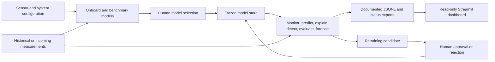

# Predictive Water Quality Monitoring and Operational Decision Support Using AI and IoT

A research-grade, configuration-driven system for water-quality prediction, explainability, anomaly detection, model monitoring, human-approved retraining, and operational visualization.

Developed as an internship project at the Smart Engineering Systems Center (SESC), Nile University, Giza. An IEEE NILES 2026 paper is in preparation.

> [!IMPORTANT]
> This repository is a research prototype. Its current data is historical, not a live IoT feed, and the dashboard does not provide a drinking-water safety or regulatory-compliance verdict.

## Project overview

The repository contains two decoupled applications:

| Component | Purpose | Data access |
|---|---|---|
| **ML monitoring pipeline** | Benchmarks and freezes parameter-specific models, produces predictions and SHAP explanations, detects anomalies, evaluates retraining conditions, and computes short-term forecasts. | Reads model/configuration data and appends accepted monitoring rows to the selected historical dataset and export files. |
| **Streamlit dashboard** | Presents exported measurements, predictions, anomalies, SHAP explanations, and available model-monitoring metrics in English or Arabic. | Read-only; consumes documented exports and never imports model pickle files or writes back to the pipeline. |

The pipeline is parameter-agnostic. Sensors are declared in [`config/sensors_config.json`](config/sensors_config.json), while the dashboard discovers parameters dynamically from the files available in `exports/`.

## Key capabilities

### ML pipeline

- Configuration-driven sensor onboarding and time-aware feature engineering
- Chronological benchmarking of Random Forest, XGBoost, and SVR variants
- Explicit human selection before a model is frozen
- Prediction explanations using SHAP feature attributions
- Residual-based anomaly detection when a measured value is supplied
- Optional drift and retraining evaluation with human approval before promotion
- Recursive multi-step forecasting inside the monitoring workflow
- Atomic rolling JSONL and status exports for external consumers

### Dashboard

- Professional, read-only Streamlit interface
- Dynamic parameter discovery from monitoring exports
- Measured-versus-predicted charts with preserved missing-value gaps
- Red anomaly markers positioned on measured values
- Record-level anomaly and alert table
- SHAP explanation panel
- Neutral model-monitoring metrics without an unsupported health classification
- English and Arabic localization with right-to-left layout support
- Historical-data framing and configurable future continuous-source mode
- Forecast navigation that appears only when valid forecast values are exported
- Methodology-only historical WQI diagnostic with explicit scientific caveats
- Graceful handling of missing, null, malformed, incomplete, and duplicate records

## Architecture



No retraining candidate is promoted automatically. Promotion requires the explicit approval workflow exposed by `python run.py approve`.

## Current data availability

The repository currently includes real dashboard export files for **EC only**:

- `exports/EC.jsonl`
- `exports/EC_status.json`

The dashboard therefore discovers and displays EC. Other configured or modelled parameters do not appear until their own valid export records exist.

Additional constraints of the current export set:

- Forecasts are calculated inside the monitoring pipeline but are not yet serialized into the dashboard export contract. The Forecast page is consequently hidden.
- Model version, last model update, R², and drift status are not currently available in the supplied exports. Optional null fields are omitted from the interface.
- The EC records are historical research/replay data and include sharply alternating measurements in tight succession. The dashboard preserves and discloses those values rather than smoothing or replacing them.
- SQL Server Historical archive mode is optional and contains no repository-committed database. It appears only when `DB_CONN_STR` is configured and valid records have been ingested.

## Quick start

### Prerequisites

- Python 3.11 or newer
- Git
- A shell capable of running the commands below

Clone the repository and create a virtual environment:

```bash
git clone https://github.com/Anasslh/Predictive-Water-Quality-Monitoring-and-Operational-Decision-Support-Using-AI-and-IoT.git
cd Predictive-Water-Quality-Monitoring-and-Operational-Decision-Support-Using-AI-and-IoT
python -m venv .venv
```

Activate it:

```powershell
# Windows PowerShell
.venv\Scripts\Activate.ps1
```

```bash
# macOS / Linux / WSL
source .venv/bin/activate
```

Install the dependencies you need:

```bash
# ML pipeline
python -m pip install -r requirements.txt

# Dashboard runtime and tests
python -m pip install -r dashboard/requirements.txt
```

The dashboard dependencies are deliberately separate. A dashboard-only deployment does not require scikit-learn, XGBoost, SHAP, or access to model artifacts.

## Run the dashboard

From the repository root:

```bash
python -m streamlit run dashboard/app.py
```

Alternatively, use the platform helper:

```powershell
# Windows PowerShell
./dashboard/run_dashboard.ps1
```

```bash
# macOS / Linux / WSL
./dashboard/run_dashboard.sh
```

Open <http://localhost:8501> if the browser does not open automatically.

### Dashboard views

| View | Contents |
|---|---|
| **Overview** | Latest measured state, trend, affected-parameter anomaly count, source mode, and model-monitoring availability |
| **Parameter detail** | Chronological measured and predicted series, preserved gaps, anomaly markers, date filtering, data-quality notes, and SHAP context |
| **Forecast** | Valid exported multi-step forecasts; automatically absent while the export contract contains none |
| **Anomalies & alerts** | Record-level table of exported anomaly observations and retraining alerts |
| **Model monitoring** | Available RMSE, MAE, skill-versus-persistence, counts, and non-null optional metadata |
| **Data & methodology** | Source description, data policies, known limitations, reference methods, and the historical WQI diagnostic |

### Dashboard configuration

All settings are optional and resolve relative to the repository root by default.

| Environment variable | Default | Purpose |
|---|---|---|
| `WQD_EXPORTS_DIR` | `<repo>/exports` | Directory containing `<parameter>.jsonl` and optional status files |
| `WQD_PROCESSED_DIR` | `<repo>/data/processed` | Location of the processed historical dataset used by the Methodology page |
| `WQD_SITE_NAME` | `C-1 — Ramgarh Station` | Configurable source label |
| `WQD_DATA_SOURCE_MODE` | `historical` | `historical` disables live freshness-alert semantics; `continuous` enables the documented cadence heuristic |
| `WQD_DATA_SOURCE_NOTE` | Translated historical-data label | Optional source qualifier |
| `WQD_WATER_USE` | `generalist` | Water-use framing profile |
| `WQD_DEFAULT_LANG` | `en` | Interface language: `en` or `ar` |
| `WQD_RETENTION_DAYS` | `30` | Expected rolling export window |
| `WQD_FRESH_MULTIPLIER` | `3.0` | Continuous-mode freshness heuristic multiplier |
| `DB_CONN_STR` | unset | Enables the optional SQL Server Historical archive source; keep secrets outside source control |
| `WQD_WARM_SITE_ID` | `WQD_SITE_ID` / `C-1` | Site used to scope historical queries |
| `WQD_WARM_LOOKBACK_DAYS` | `365` | Maximum selectable historical query window |
| `WQD_DB_TIMEOUT_SECONDS` | `5` | SQL connection and query timeout |

Example:

```bash
WQD_EXPORTS_DIR=/synced/exports WQD_DEFAULT_LANG=ar python -m streamlit run dashboard/app.py
```

For the exact schema and behavior, see:

- [`dashboard/DATA_CONTRACT.md`](dashboard/DATA_CONTRACT.md)
- [`dashboard/ASSUMPTIONS.md`](dashboard/ASSUMPTIONS.md)
- [`dashboard/IMPLEMENTATION_REPORT.md`](dashboard/IMPLEMENTATION_REPORT.md)
- [`dashboard/WARM_TIER.md`](dashboard/WARM_TIER.md)

### Optional SQL Server historical archive

The monitoring pipeline writes a permanent monthly Cold archive. A manual CLI
export can be validated and idempotently ingested into SQL Server, after which
the operator can select **Historical archive** globally in the dashboard.

```powershell
python run.py export-archive --parameter EC --months 12 --output warm_tier/EC_last_12m.jsonl
python warm_tier_etl.py --init-schema
python warm_tier_etl.py warm_tier/EC_last_12m.jsonl --site-id C-1 --parameter EC --unit "µS/cm"
```

This handoff is manual; no scheduled ingestion is claimed. See
[`dashboard/WARM_TIER.md`](dashboard/WARM_TIER.md) for SQL provisioning,
configuration, schema, security, failure behavior, and integration testing.

## Run the ML pipeline

The unified entry point is `run.py`:

```bash
python run.py --help
```

### 1. Onboard and benchmark models

For one parameter:

```bash
python run.py onboard --dataset data/processed/c1_with_wqi.csv --parameter EC
```

For all configured parameters:

```bash
python run.py onboard --all --dataset data/processed/c1_with_wqi.csv
```

Batch onboarding saves pending benchmark reports without freezing a model. Review each parameter explicitly:

```bash
python run.py review EC
python run.py review pH
python run.py review Turbidity
```

### 2. Process a measurement

`monitor` accepts a raw sensor row, reconstructs features from historical context, predicts, explains the prediction, optionally evaluates anomalies and retraining, computes an internal forecast, and updates the monitoring exports.

```bash
python run.py monitor --parameter EC --dataset data/processed/c1_with_wqi.csv --new-row data/processed/ec_new_row_example.csv --actual-value 769
```

> [!WARNING]
> Unlike the dashboard, the monitoring pipeline is not read-only. A successful `monitor` call atomically appends the accepted raw row to the dataset supplied through `--dataset`. Use a copy for demonstrations or experiments.

Common monitoring options:

| Option | Effect |
|---|---|
| `--actual-value <number>` | Supplies the measured value required for residual-based anomaly evaluation |
| `--check-retrain` | Enables the optional retraining-condition check |
| `--no-anomaly` | Skips anomaly detection |
| `--no-forecast` | Skips internal multi-step forecasting |

See [`GUIDE_MONITOR_STAGES.md`](GUIDE_MONITOR_STAGES.md) for the full stage-by-stage workflow.

### 3. Inspect status and review retraining candidates

```bash
python run.py status
python run.py status --parameter EC
python run.py approve
python run.py approve <approval_id>
python run.py approve --reject-all-stale
```

## Export contract

Each monitored parameter can produce:

| File | Purpose |
|---|---|
| `exports/<parameter>.jsonl` | Rolling measurement and prediction records, including timestamps, actual and predicted values, SHAP features, anomaly fields, and retraining alerts |
| `exports/<parameter>_status.json` | Available model metadata, performance metrics, measurement time, and approval/rejection counts |

The dashboard reads only these exports plus the processed WQI artifact used on the Methodology page. It does not import `src/`, load pickles, acknowledge incidents, or modify any export.

For longer history, `run.py export-archive` produces a bounded flat JSONL from
the permanent Cold archive. `warm_tier_etl.py` validates and upserts that file
into SQL Server. This does not redefine the Hot export contract.

### Record and chart policies

- Records are sorted chronologically.
- Exact duplicates are removed. For conflicting records with one parseable timestamp, the last complete source record wins.
- Fields from separate duplicate records are never combined.
- A missing measured value remains missing and is never replaced by a prediction.
- Measured lines preserve gaps; predicted lines use a distinct dashed style.
- Anomaly markers are placed only on available measured values.
- “Parameters with active anomalies” counts affected parameters whose latest evaluated record is anomalous; the alerts table remains record-level.

## Configuration

### Sensor configuration

[`config/sensors_config.json`](config/sensors_config.json) declares timestamp candidates and one object per sensor. The current configuration includes EC, Turbidity, pH, and Temperature.

Key fields include:

| Field | Purpose |
|---|---|
| `column_name` | Exact raw-data column |
| `parameter_name` | Stable parameter identifier used in models, reports, and exports |
| `unit` | Display and reporting unit |
| `co_variables` | Optional cross-variable lag features |
| `lag_hours` | Time-based lag depths converted to row counts at runtime |
| `rolling_hours` | Time-based rolling-window durations |
| `forecast_horizon_hours` | Forecast horizon converted to steps using the detected frequency |
| `wqi_standard` | Reference used by the separate historical WQI methodology; not an operational alert threshold |

See [`config/README_sensors_config.md`](config/README_sensors_config.md) for the schema reference.

### System configuration

[`config/system_config.json`](config/system_config.json) centralizes model grids, validation bounds, anomaly settings, retraining policy, export retention, and logging. Current thresholds are engineering or research settings, not regulatory limits.

## Repository structure

```text
config/          Sensor declarations and system settings
database/        Versioned SQL Server Warm-tier provisioning and schema scripts
dashboard/       Streamlit application, components, services, localization, tests, and technical docs
data/            Raw, interim, and processed research datasets
exports/         Dashboard-facing monitoring exports
models_store/    Frozen models, metadata, reports, and approval state
reports/         Scientific, methodological, and implementation reports
src/             Pipeline, models, monitoring, XAI, anomaly, forecasting, and retraining modules
tests/           Additional repository-level test support
run.py           Unified command-line entry point
run_tests.sh     Pipeline test runner
```

## Testing

Run pipeline self-tests from Bash, WSL, macOS, or Linux:

```bash
./run_tests.sh
```

Run the pipeline tests through pytest:

```bash
./run_tests.sh --pytest
```

Run the dashboard suite from any supported platform:

```bash
python -m pytest dashboard/tests -q
```

The SQL Server integration test is skipped unless an isolated test database is
explicitly configured through `WQD_TEST_DB_CONN_STR`; see `dashboard/WARM_TIER.md`.

The dashboard suite covers discovery, valid and malformed JSONL parsing, absent exports and status files, null optional fields, deterministic duplicate handling, chronological transforms, missing measured values, anomaly positions and counts, forecast gating, WQI placement, English rendering, and Arabic RTL rendering.

## Scientific framing and WQI

The dashboard uses general water-monitoring language and does not determine whether water is safe to drink.

The Water Quality Index shown on **Data & methodology** is:

- calculated from the processed historical dataset;
- outside the live/dashboard monitoring export contract;
- based on drinking-water reference standards;
- limited by its available parameters and single-station dataset; and
- a historical diagnostic, not a live alert, regulatory assessment, or proof of drinking-water safety.

WQI reference values are never used as operational chart limits or anomaly thresholds.

## Known limitations

- **Historical single-station dataset:** Current modelling uses C-1 Ramgarh Station research data covering approximately one year. Generalization to other sites or sampling frequencies is unverified.
- **No physical IoT deployment:** MQTT, sensor drivers, network resilience, and Raspberry Pi operation have not been validated in this repository.
- **Only EC has dashboard exports:** Other parameters remain hidden until valid records are produced.
- **Forecast export gap:** Forecasting exists internally but is not yet part of the dashboard export schema.
- **No approved model-health classification:** Available metrics are displayed neutrally without a green “healthy” verdict.
- **No authentication or operator write-back:** The dashboard does not implement accounts, acknowledgements, or incident management.
- **Dataset shift and limited calibration:** Seasonal distribution shift and the limited sample size affect evaluation and drift diagnostics; see the reports below.
- **Engineering bounds are not regulatory thresholds:** Physical validation bounds and anomaly defaults must be reviewed for any new site or operational use.
- **Warm ingestion is manual:** Cold export and SQL ingestion are CLI operations; scheduling, retry orchestration, backup, and retention management are deployment work.
- **No historical model-status contract:** Model metrics and pending approvals are current-only and are shown as unavailable in Historical archive mode.

## Reports and further documentation

| Document | Contents |
|---|---|
| [`reports/rapport_ec_pipeline_complet.md`](reports/rapport_ec_pipeline_complet.md) | EC pipeline, feature engineering, model comparison, distribution-shift diagnosis, and SHAP analysis |
| [`reports/rapport_generalisation_pipeline.md`](reports/rapport_generalisation_pipeline.md) | Generic pipeline validation across parameters |
| [`reports/rapport_module_reentrainement.md`](reports/rapport_module_reentrainement.md) | Drift detection and human-approved retraining policy |
| [`reports/week2_report.md`](reports/week2_report.md) | Literature review and methodology matrix |
| [`reports/methodology_toolbox.md`](reports/methodology_toolbox.md) | Implementation notes and architecture decisions |
| [`reports/implementation_plan.md`](reports/implementation_plan.md) | Project plan and scope |
| [`reports/ie_dashboard_progress.md`](reports/ie_dashboard_progress.md) | Dashboard development and review history |

## Citation and project status

This is an academic research project developed at SESC, Nile University, Giza. The associated IEEE NILES 2026 paper title and DOI will be added if accepted.

No standalone software license has been declared in this repository. Contact the repository owners before reuse or redistribution beyond review and research purposes.
